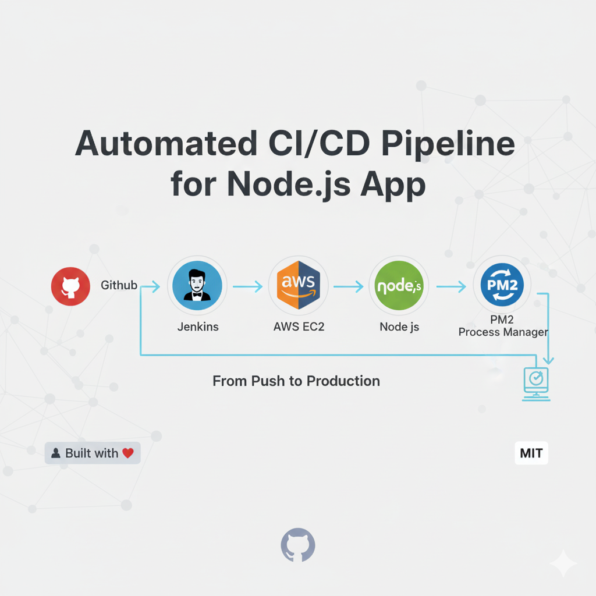
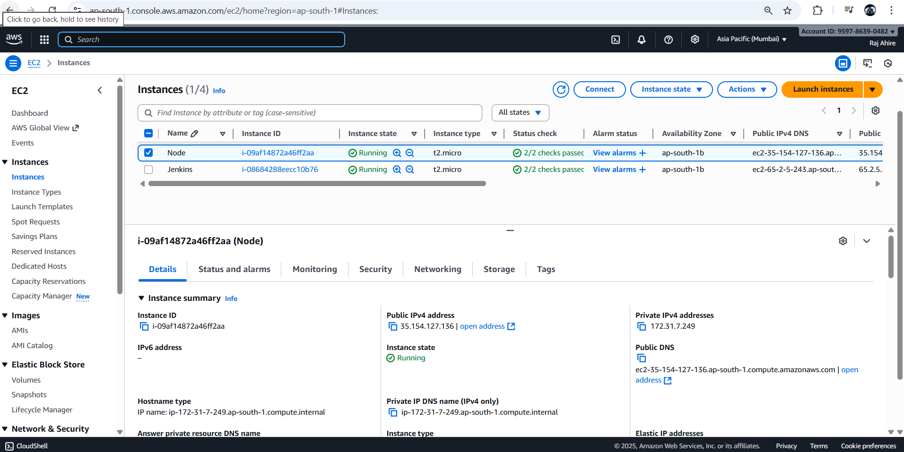
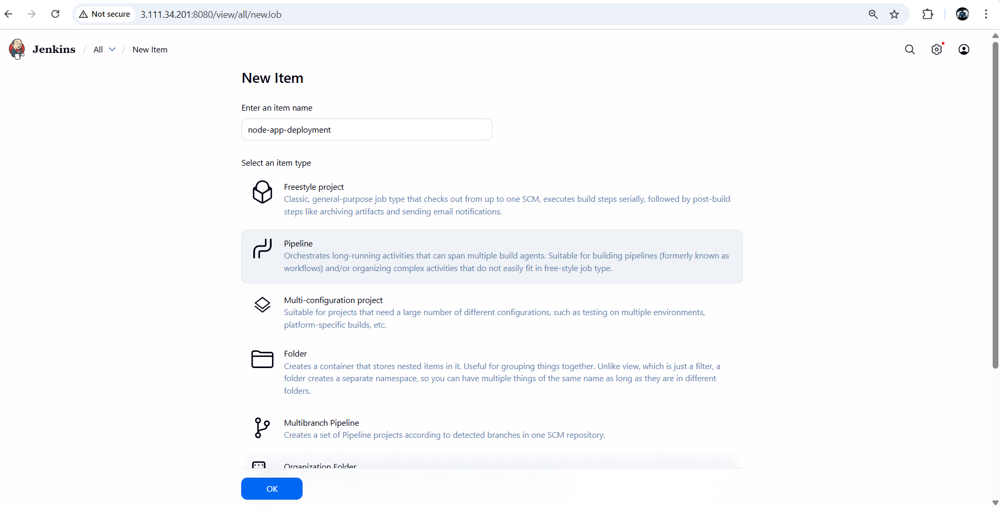
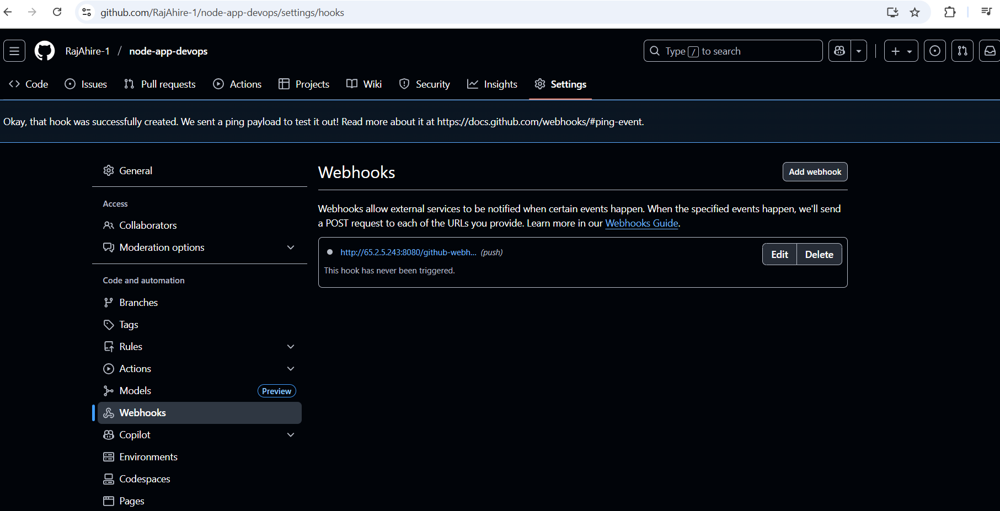
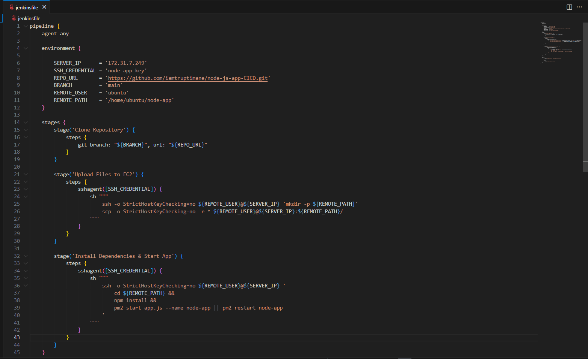
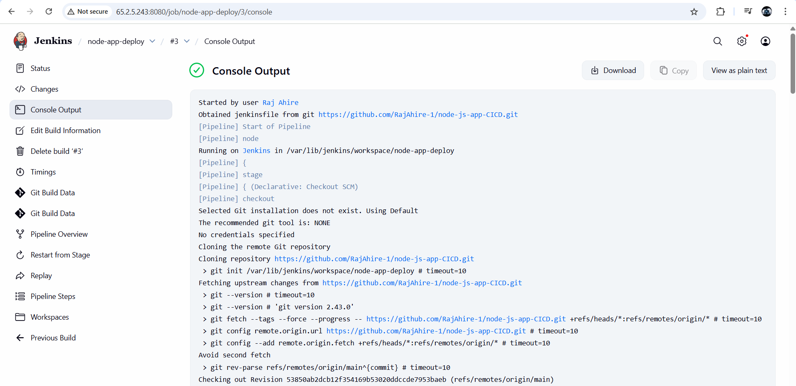
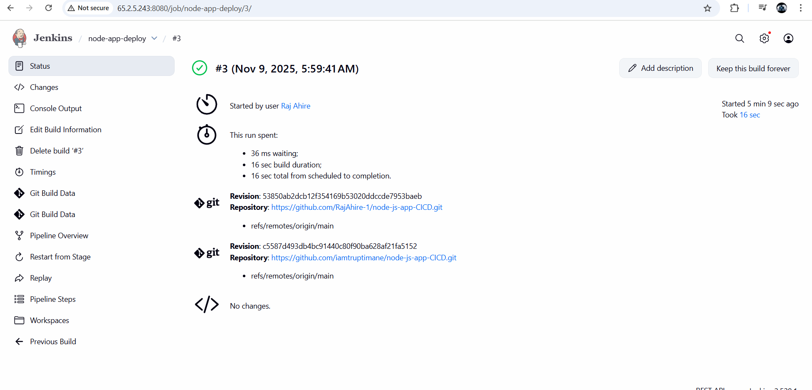

# Automated CI/CD Pipeline for Node.js Application using Jenkins and AWS EC2

[]()
[]()
[]()
[]()

This repository demonstrates a complete CI/CD pipeline for a Node.js application using **Jenkins**, **GitHub Webhooks**, and **AWS EC2**.  
Each code push to GitHub automatically triggers Jenkins to build, test, and deploy the latest version to an EC2 instance.

---

## 1. Overview


### Technologies Used
- **Node.js (Express.js)** — Backend application  
- **Jenkins** — CI/CD automation server  
- **GitHub Webhooks** — Automatic build trigger  
- **AWS EC2** — Deployment and hosting  
- **PM2** — Node.js process management  

---

## 2. Architecture Workflow

1. Developer pushes code to the GitHub repository  
2. GitHub Webhook notifies Jenkins  
3. Jenkins pipeline:
   - Pulls latest source code  
   - Installs dependencies  
   - Uploads project to AWS EC2 via SSH  
   - Installs dependencies on EC2  
   - Starts or restarts the Node.js app using PM2  
4. Application automatically runs on EC2 without manual intervention  

---

## 3. AWS Infrastructure

Two EC2 instances are used:

| Instance | Purpose | Type | Status |
|-----------|----------|------|---------|
| Jenkins   | CI/CD Automation | t2.micro | Running |
| Node      | Application Deployment | t2.micro | Running |

**AWS EC2 Instances:**



---

## 4. Jenkins Setup

### 4.1 Create a New Pipeline
From Jenkins Dashboard → **New Item → Pipeline → OK**

- **Pipeline Name:** `node-app-deploy`  
- **Type:** Pipeline  
- **SCM:** Git  
- **Repository URL:** `https://github.com/RajAhire-1/Book-App-CI-CD.git`  
- **Branch:** `main`

**Pipeline Setup Screenshot:**



---

## 5. GitHub Webhook Integration

Set up a webhook in GitHub to automatically trigger Jenkins on every code push.

**Steps:**
1. Go to **Repository → Settings → Webhooks**  
2. Click **Add Webhook**  
3. **Payload URL:** `http://126.23.54.15:8080/github-webhook/`  
4. **Content Type:** `application/json`  
5. Trigger: “Just the push event”  
6. Save  

**Webhook Screenshot:**



---

## 6. Jenkinsfile Configuration

Below is the `Jenkinsfile` used for automating the CI/CD process.

**Jenkinsfile in VS Code:**



```groovy
pipeline {
    agent any

    environment {
        SERVER_IP      = '172.31.7.249'
        SSH_CREDENTIAL = 'node-app-key'
        REPO_URL       = 'https://github.com/RajAhire-1/node-app-devops.git'
        BRANCH         = 'main'
        REMOTE_USER    = 'ubuntu'
        REMOTE_PATH    = '/home/ubuntu/node-app'
    }

    stages {
        stage('Clone Repository') {
            steps {
                git branch: "${BRANCH}", url: "${REPO_URL}"
            }
        }

        stage('Upload Files to EC2') {
            steps {
                sshagent([SSH_CREDENTIAL]) {
                    sh """
                        ssh -o StrictHostKeyChecking=no ${REMOTE_USER}@${SERVER_IP} 'mkdir -p ${REMOTE_PATH}'
                        scp -o StrictHostKeyChecking=no -r * ${REMOTE_USER}@${SERVER_IP}:${REMOTE_PATH}/
                    """
                }
            }
        }

        stage('Install Dependencies & Start App') {
            steps {
                sshagent([SSH_CREDENTIAL]) {
                    sh """
                        ssh -o StrictHostKeyChecking=no ${REMOTE_USER}@${SERVER_IP} '
                            cd ${REMOTE_PATH} &&
                            npm install &&
                            pm2 start app.js --name node-app || pm2 restart node-app
                        '
                    """
                }
            }
        }
    }

    post {
        success {
            echo 'Application deployed successfully.'
        }
        failure {
            echo 'Deployment failed.'
        }
    }
}
````

---

## 7. Jenkins Pipeline Execution

Each time code is pushed to GitHub, Jenkins automatically triggers a new build and deploys it to EC2.

**Successful Build Console Output:**



**Build Status Page:**



---

## 8. Application Deployment (Frontend)

Once deployed, the application runs at:

```
http://129.53.46.25:3000
```

**Homepage View:**


**Movie Details Modal:**


---

## 9. Directory Structure

```
node-app-devops/
├── app.js
├── start.js
├── package.json
├── Jenkinsfile
├── README.md
└── public/
    ├── index.html
    ├── app.css
    └── main.js
```

---

## 10. CI/CD Workflow Summary

| Step | Description                            | Tool    |
| ---- | -------------------------------------- | ------- |
| 1    | Code pushed to GitHub                  | Git     |
| 2    | Webhook triggers Jenkins               | GitHub  |
| 3    | Jenkins clones and builds code         | Jenkins |
| 4    | Files uploaded to EC2                  | SSH     |
| 5    | Dependencies installed and app started | PM2     |

---


## 11. Results

* Automated Jenkins pipeline triggered via GitHub push
* Application deployed to AWS EC2 without manual steps
* Fully functional CI/CD pipeline with PM2 process management

**Successful Jenkins Run:**


---

## Author

**Raj Ahire**
DevOps Engineer | AWS | Jenkins | Node.js
GitHub: [RajAhire-1](https://github.com/RajAhire-1)


